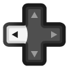
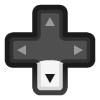

pFBN: Portable FinalBurn Neo
===============================


-----

#### The main goals of this [fbneo](https://github.com/finalburnneo/FBNeo) port are:

- have a basic but user-friendly user interface
- use a recent rendering interface for speed and effect support
- cross-platform and code portability
- easy updates of fbneo core (no modifications to the original sources)
- use arm asm m68k ([cyclone](https://github.com/notaz/cyclone68000)) core on arm devices

-----

#### Supported devices

- Linux
- Windows
- Sony Ps Vita
- Sony PS4
- Nintendo Switch

-----

#### GENERAL INFORMATION'S

- pFBN current DATs files are located [here](https://github.com/libretro/FBNeo/tree/e8694e1806d56061554b7a80f3601caeb085dedc/dats).

- pFBN, as fbneo, support consoles roms. Here is the default configuration for your roms paths:
    ```
    NAME       SYSTEM    SYSTEM_ID     PATH
    ARCADE = ( "Arcade", "0x12341234", "/media/cpasjuste/Data/emulation/01_roms/fbneo-1.0.0.03-full/arcade/" );
    CHANNELF = ( "Channel F", "0x21000000", "/home/cpasjuste/dev/multi/pemu/cmake-build-debug/src/cores/pfbneo/channelf/" );
    COLECO = ( "ColecoVision", "0x1a000000", "/home/cpasjuste/dev/multi/pemu/cmake-build-debug/src/cores/pfbneo/coleco/" );
    FDS = ( "NES FDS", "0x1f000000", "/home/cpasjuste/dev/multi/pemu/cmake-build-debug/src/cores/pfbneo/fds/" );
    GAMEGEAR = ( "Sega Game Gear", "0x12000000", "/home/cpasjuste/dev/multi/pemu/cmake-build-debug/src/cores/pfbneo/gamegear/" );
    MEGADRIVE = ( "Sega Megadrive", "0x0c000000", "/home/cpasjuste/dev/multi/pemu/cmake-build-debug/src/cores/pfbneo/megadrive/" );
    MSX = ( "MSX", "0x1c000000", "/home/cpasjuste/dev/multi/pemu/cmake-build-debug/src/cores/pfbneo/msx/" );
    NES = ( "NES", "0x1e000000", "/home/cpasjuste/dev/multi/pemu/cmake-build-debug/src/cores/pfbneo/nes/" );
    NGP = ( "Neo Geo Pocket", "0x20000000", "/home/cpasjuste/dev/multi/pemu/cmake-build-debug/src/cores/pfbneo/ngp/" );
    PCE = ( "PC Engine", "0x17010000", "/home/cpasjuste/dev/multi/pemu/cmake-build-debug/src/cores/pfbneo/pce/" );
    SG1000 = ( "Sega SG-1000", "0x19000000", "/home/cpasjuste/dev/multi/pemu/cmake-build-debug/src/cores/pfbneo/sg1000/" );
    SGX = ( "PC Engine SGX", "0x17030000", "/home/cpasjuste/dev/multi/pemu/cmake-build-debug/src/cores/pfbneo/sgx/" );
    MASTERSYSTEM = ( "Sega Master System", "0x18000000", "/home/cpasjuste/dev/multi/pemu/cmake-build-debug/src/cores/pfbneo/sms/" );
    SPECTRUM = ( "ZX Spectrum", "0x1d000000", "/home/cpasjuste/dev/multi/pemu/cmake-build-debug/src/cores/pfbneo/spectrum/" );
    TG16 = ( "PC Engine TG16", "0x17020000", "/home/cpasjuste/dev/multi/pemu/cmake-build-debug/src/cores/pfbneo/tg16/" );
    ```
  Please note that, unlike other pEMU emulators, **you need to use [a specific system id (HARDWARE_XXX)](https://github.com/finalburnneo/FBNeo/blob/36092078ac2ba48acf2105d2cad8310ab2236224/src/burn/burn.h#L494) for each system**.
The "Arcade" system id "0x12341234" is a special case, arcade roms found in this path will get their system/id from fbneo internal drivers database.
-----

### NINTENDO SWITCH INFORMATION

* ##### NINTENDO SWITCH CONTROLS (UI)
|                                                                                                   Buttons                                                                                                   | Action                                 |
|:-----------------------------------------------------------------------------------------------------------------------------------------------------------------------------------------------------------:|----------------------------------------|
|                                                                                                           | General options + default roms options |
|                                                                                                           | Per rom options                        |
|  /  | Switch systems                         |

* ##### NINTENDO SWITCH CONTROLS (UI, SINGLE JOYCON MODE, 1P ONLY)
|                                                                                                   Buttons                                                                                                   | Action                                 |
|:-----------------------------------------------------------------------------------------------------------------------------------------------------------------------------------------------------------:|----------------------------------------|
|    /    | General options + default roms options |
|    /    | Per rom options                        |
|  /  | Switch systems (SL/SR)                 |

* ##### NINTENDO SWITCH CONTROLS (IN-GAME)
|                                                                                                                                                                                                      Buttons                                                                                                                                                                                                      | Action                               |
|:-----------------------------------------------------------------------------------------------------------------------------------------------------------------------------------------------------------------------------------------------------------------------------------------------------------------------------------------------------------------------------------------------------------------:|--------------------------------------|
|                                                                                                                                                                                                                                                                                                                 | Coins                                |
|                                                                                                                                                                                                                                                                                                                 | Start                                |
|                                                                                                       +                                                                                                       | pFBN menu                            |
|  +  +  +  | UniBios menu (Neo-Geo)               |
|                                                                                                                                                                                                                                                                                                                 | Hold 2 seconds for diagnostic menu   |
|                                                                                                                                                                                                                                                                                                                 | Hold 2 seconds to reset current game |

* ##### NINTENDO SWITCH CONTROLS (IN-GAME, SINGLE JOYCON MODE, LEFT)
|                                                                                                                                                                                                       Buttons                                                                                                                                                                                                        | Action                                         |
|:--------------------------------------------------------------------------------------------------------------------------------------------------------------------------------------------------------------------------------------------------------------------------------------------------------------------------------------------------------------------------------------------------------------------:|------------------------------------------------|
|                                                                                                                                                                                                                                                                                                                    | Coins                                          |
|                                                                                                                                                                                                                                                                                                                    | Start                                          |
|                                                                                                        +                                                                                                         | pFBN menu (1P only)                            |
|  +  +  +  | UniBios menu (Neo-Geo) (1P only)               |
|                                                                                                                                                                                                                                                                                                                    | Hold 2 seconds for diagnostic menu (1P only)   |
|                                                                                                                                                                                                                                                                                                                    | Hold 2 seconds to reset current game (1P only) |

* ##### NINTENDO SWITCH CONTROLS (IN-GAME, SINGLE JOYCON MODE, RIGHT)
|                                                                                                                                                                                                      Buttons                                                                                                                                                                                                      | Action                                         |
|:-----------------------------------------------------------------------------------------------------------------------------------------------------------------------------------------------------------------------------------------------------------------------------------------------------------------------------------------------------------------------------------------------------------------:|------------------------------------------------|
|                                                                                                                                                                                                                                                                                                                 | Coins                                          |
|                                                                                                                                                                                                                                                                                                                 | Start                                          |
|                                                                                                       +                                                                                                       | pFBN menu (1P only)                            |
|  +  +  +  | UniBios menu (Neo-Geo) (1P only)               |
|                                                                                                                                                                                                                                                                                                                 | Hold 2 seconds for diagnostic menu (1P only)   |
|                                                                                                                                                                                                                                                                                                                 | Hold 2 seconds to reset current game (1P only) |
-----

### PS VITA INFORMATION'S ((may be outdated))

- data is located at "ux0:/data/pfba"
- default rom path is "ux0:/data/pfba/roms/"
- rom path can be changed in "ux0:/data/pfba/pfba.cfg"
- preview images can be put in "ux0:/data/pfba/previews/rom-name.png"
- ui: START = general options + default roms configuration
- ui: SELECT = per rom configuration
- in game: SELECT+START = menu
- in game: SELECT+L = saves states
- in game: SELECT+SQUARE = service switch
- in game: SELECT+TRIANGLE = 1P+2P switch
- in game: SELECT+LEFT/RIGHT = change shader
- in game: SELECT+UP/DOWN = change scaling

----

### COMPILATION

- see pemu [README.MD](https://github.com/Cpasjuste/pemu)

-----

### Thanks
- Xavier for the support (http://www.consolex-bordeaux.fr/)
- ScHlAuChi for all the advices, testing, and hardware support
- fba/mame authors (http://www.fbalpha.com/, http://mamedev.org/)
- xerpi for vita2d (https://github.com/xerpi/libvita2d)
- frangarcj for vita2d shader support (https://github.com/frangarcj/vita2dlib)
- people behind the vitasdk (https://github.com/vitasdk)
- WinterMute and fincs, for their continue work on the Nintendo Switch
- [screencraper.fr](https://www.screenscraper.fr/)
